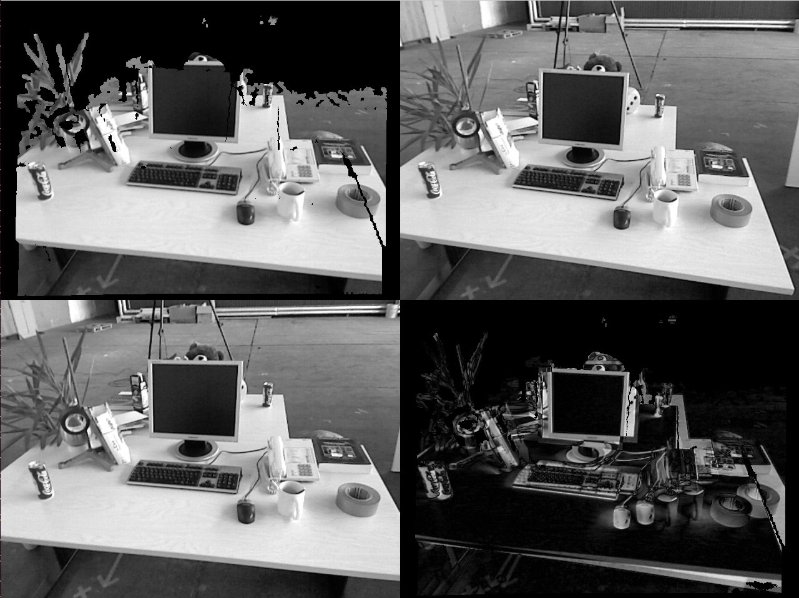
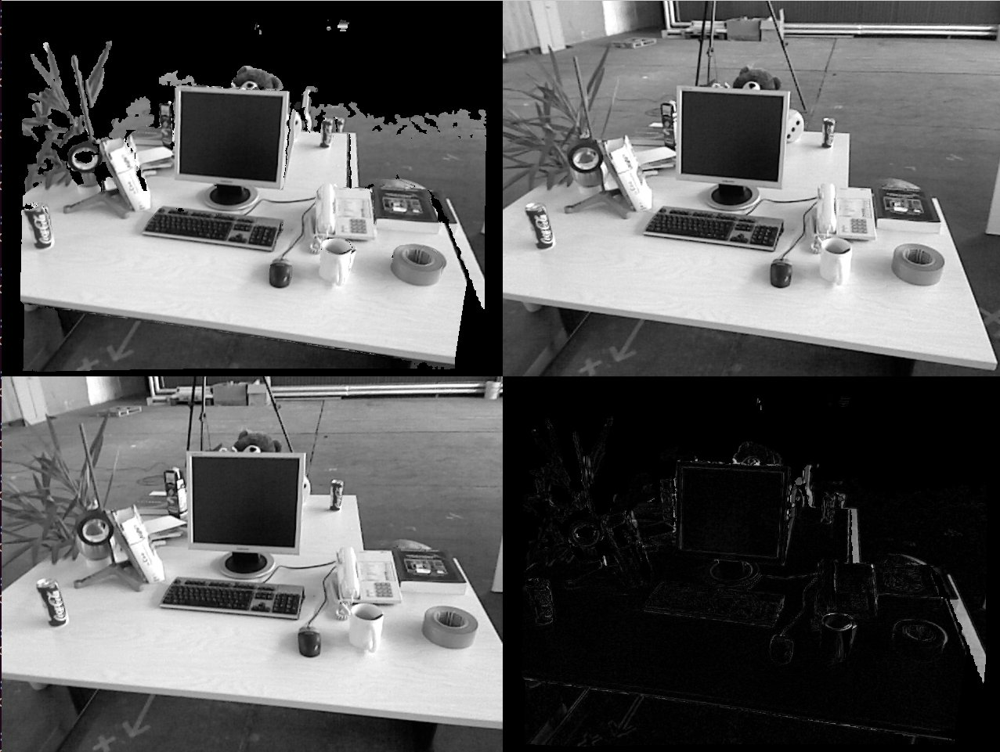

# direct-bundle-adjustment-tensorflow

Simple tensorflow implementation of direct SLAM pose registeration method via Gauss-Newton.

Referred paper: `BA-Net: Dense Bundle Adjustment Network, ICLR2019`

### run 
`python pose_registeration.py`

#### unregistered image 
first row: [ warpped image, target image],   second row [ src image, alignment error]

#### registered image 

